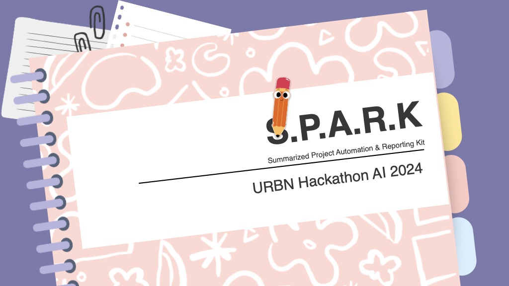

# S.P.A.R.K.

URBN 2024 Hackathon entry. **Summarized Project Automation and Reporting Kit**, or S.P.A.R.K. for short, will automatically generate release sumary emails, broken down by each team.

## Table of Contents

- [Local Setup](#local-setup)
- [Tools](#tools)
- [PAT Setup](#pat-setup)

## Local Setup

For details on setting up and developing the client application, see [Local Setup](./local-setup.md).

## Tools

For a comprehensive list of the available tools, see [Tools](./tools.md).

## PAT Setup

For instructions on creating and validating your GitHub Personal Access Token, see [GitHub PAT Setup](./github-pat.md).

For instructions on creating and validating your Jira Personal Access Token (PAT), see [Jira PAT Setup](./jira-pat.md).
